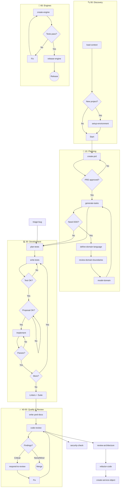

# Rails Agent Skills


> **Rails Agent Skills** turns AI coding assistants into reliable Rails engineers — not just autocomplete tools.
>
> It is a curated library of production-grade agent skills that encode conventions, workflows, and strict quality gates (TDD-first), so assistants generate code that actually holds up in real projects.

---

## Why this exists

Most AI-generated code fails in real Rails apps because it lacks:

- awareness of project conventions
- disciplined workflows (especially TDD)
- structured context across tasks

This library fixes that by giving agents **explicit skills and workflows** — from PRD → tasks → implementation → review — with tests acting as a hard gate before any code is written.

The goal is simple: **make AI outputs predictable, testable, and production-ready.**

---

## The Proof: Baseline vs Context

We measure the effectiveness of our skills by comparing a "Baseline" agent (raw LLM) against an agent using our **Skill Context**. The difference in scores (the **Lift**) is the mathematical proof of the value this library provides.

| Skill | Baseline | With Context | **Lift** |
|-------|----------|--------------|----------|
| `plan-tickets` | 30% | 100% | **+70** |
| `integrate-api-client` | 40% | 100% | **+60** |
| `generate-tasks` (TDD quadruplets) | 43% | 100% | **+57** |
| `refactor-code` | 60% | 100% | **+40** |
| `create-service-object` | 71% | 100% | **+29** |

*Scores based on evaluation runs using Claude 3.5 Sonnet. A skill that only beats baseline marginally is considered under-specified; our goal is a significant lift on every non-generic convention.*

---

[](https://www.ruby-lang.org) [](LICENSE) [](https://github.com/igmarin/rails-agent-skills/tags) 

---

- **Repository / install path:** `rails-agent-skills` ([docs/implementation-guide.md](docs/implementation-guide.md))
- **Bootstrap discovery skill:** `[skill-router](skills/orchestration/skill-router/)` (session hook loads orchestrator)
- **Documentation:** [docs/README.md](docs/README.md) — Complete guides and workflows
- **Workflows:** [docs/workflows/](docs/workflows/) — Reference docs + callable workflow skills
- **Skill Catalog:** [docs/reference/skill-catalog.md](docs/reference/skill-catalog.md) — All 38+ skills organized by category
- **Integration Matrix:** [docs/reference/integration-matrix.md](docs/reference/integration-matrix.md) — Skill chaining and workflows
- **Skill structure:** [docs/architecture.md](docs/architecture.md)
- **Eval optimization:** [docs/skill-optimization-guide.md](docs/skill-optimization-guide.md) — baseline-vs-context targets and the per-skill loop used to lift scores

### Quick Start — Which Skill to Use?

| Goal | Skill |
|------|-------|
| Implement feature with TDD | `workflows/tdd-workflow` |
| Review PR | `workflows/review-workflow` |
| Plan new feature | `skills/planning/create-prd` → `skills/planning/generate-tasks` |
| Not sure where to start | `skills/orchestration/skill-router` |

## Methodology

This skill library is built on core principles that shape how every skill operates. For detailed guidance on skill design, read the official [Skill Design Principles](docs/skill-design-principles.md).

### 1. Tests Gate Implementation

The core principle of this project. Tests are not a phase that happens "after" development — they are a **hard gate** that must be passed before any implementation code can be written.

```text
PRD → Tasks → [GATE] → Implementation → YARD → Docs → Code review → PR
                 │
                 ├── 1. Test EXISTS (written and saved)
                 ├── 2. Test has been RUN
                 └── 3. Test FAILS for the correct reason
                        (feature missing, not a typo)

        Only after all 3 conditions are met
        can implementation code be written.

After tests pass: document public Ruby API (YARD), update README/diagrams/
related docs, then self-review (code-review) before opening the PR.
Task lists from generate-tasks include these steps explicitly.
```

This applies to every skill that produces code: service objects, background jobs, API integrations, engine components, refactoring, and bug fixes. Every implementation skill in this library includes a **HARD-GATE: Tests Gate Implementation** section enforcing this discipline.

Why this matters:

- A test that passes immediately proves nothing — you don't know if it tests the right thing
- A test you never saw fail could be testing existing behavior, not the new feature
- Implementation code written before the test is biased by what you built, not what's required

**Generated output:** All generated artifacts (documentation, YARD comments, Postman collections, examples) must be in **English** unless the user explicitly requests another language. This is reflected in the skill template and in `write-yard-docs` and `generate-api-collection`.

### 2. Workflow Chaining

Skills are designed to be used in sequence, not in isolation. Each skill's **Integration** table points to the next skill in the chain. The primary daily workflow is:

```text
skills/testing/plan-tests → skills/testing/write-tests (write failing test)
    ↓
[CHECKPOINT: Test Design Review — confirm boundary, behavior, edge cases]
    ↓
[CHECKPOINT: Implementation Proposal — confirm approach before coding]
    ↓
Implement (minimal code to pass test) → Refactor
    ↓
[GATE: Linters + Full Test Suite]
    ↓
skills/patterns/write-yard-docs → Update docs
    ↓
skills/code-quality/code-review (self-review) → skills/code-quality/respond-to-review (on feedback)
    ↓
PR
```

See [docs/workflows/](docs/workflows/) for the full TDD Feature Loop and all workflow diagrams by lifecycle stage.

**Note:** `plan-tickets` is an **optional** step. The assistant should **not** push for ticket generation unless the user asks explicitly (e.g. "turn this into tickets") or the context clearly indicates work should be mapped to a board/sprint.

### 3. Rails-First Pattern Reuse

This library intentionally reuses proven patterns from broader agent-skill libraries, but translates them into a **Rails-first** workflow instead of copying generic frontend-oriented skills one-to-one.

| Reused pattern                         | Rails-first destination in this repo                                       |
| ----------------------------------------| ----------------------------------------------------------------------------|
| PRD interview + scope control          | `create-prd`                                                               |
| Planning from requirements             | `generate-tasks`                                                           |
| TDD loop and smallest safe slice       | `write-tests` + `plan-tests`                                |
| Bug investigation to reproducible test | `triage-bug`                                                         |
| Domain language and context design     | `define-domain-language` + `review-domain-boundaries` + `model-domain` |
| Skill authoring conventions            | `docs/skill-template.md`                                                   |

The rule of thumb is: **reuse patterns, not names**. If a broader skill maps cleanly to Rails/RSpec/YARD workflows, absorb the pattern into the existing chain. Create a new skill only when there is a real Rails-specific workflow gap.

## How to Build a Feature (Your Daily Workflow)

*For a practical guide on how to talk to the AI and effectively invoke these workflows, please see our **[Workflows Index](docs/workflows/)**.*

Here is the recommended, step-by-step workflow for building a new feature from scratch using this skill library. This ensures every feature is well-planned, test-driven, and meets production-quality standards.

**Goal:** Build a new feature, e.g., "Feature A"

### Step 1: Planning & Task Breakdown

- **Action:** Define the feature's requirements.
  - **Use Skill:** [create-prd](skills/planning/create-prd/)
- **Then:** Break the PRD into a detailed, TDD-ready checklist.
  - **Use Skill:** [generate-tasks](skills/planning/generate-tasks/)

### Step 2: Start the TDD Cycle

- **Action:** Pick the first, highest-value "slice" of behavior from your task list.
- **Action:** Get guidance on choosing the right *type* of test to write first (e.g., a request spec).
  - **Use Skill:** [plan-tests](skills/testing/plan-tests/)
- **Action:** Write the first failing test. **Crucially, run it and watch it fail.**
  - **Use Skill:** [write-tests](skills/testing/write-tests/)

### Step 3: Implementation

- **Action:** Write the minimum amount of application code required to make your failing test pass.
  - **Use Skills:** [create-service-object](skills/patterns/create-service-object/) for business logic, [apply-code-conventions](skills/code-quality/apply-code-conventions/) for general code quality.

### Step 4: Verification

- **Action:** Run the test again and watch it pass.
- **Action:** Run linters and the full test suite to ensure no regressions. Refactor your new code if needed.

### Step 5: Documentation & Self-Review

- **Action:** Add inline documentation to any new public classes or methods.
  - **Use Skill:** [write-yard-docs](skills/patterns/write-yard-docs/)
- **Action:** Perform a self-review of your changes.
  - **Use Skill:** [code-review](skills/code-quality/code-review/)

### Step 6: Responding to Peer Review

- **Action:** When you receive feedback from teammates, evaluate and implement their suggestions systematically.
  - **Use Skill:** [respond-to-review](skills/code-quality/respond-to-review/)

*For more detailed diagrams of these flows, see the **[Workflows Index](docs/workflows/)**.*

## MCP Server

The recommended way to use this library is via the embedded Ruby MCP server. The primary setup is local Ruby/Bundler; Docker is supported as a fallback for environments that do not want a local Ruby toolchain.

The `use_skill` tool loads individual skills on demand, while docs and workflows remain available as MCP resources. That keeps the runtime contract small while still making the full skill library available.

```text
tools/call use_skill { "skill_name": "implement-graphql" }
→ returns full SKILL.md instructions
```

Published MCP surface:

| Prefix            | Source                                     |
| -------------------| --------------------------------------------|
| `doc/<name>`      | All files under `docs/`                    |
| `workflow/<name>` | All workflow definitions                   |
| `use_skill`       | Tool that returns the `SKILL.md` for a named skill |

Adding a new skill directory automatically makes it available through `use_skill` — no server changes needed.

See **[mcp_server/README.md](mcp_server/README.md)** for the canonical MCP setup instructions and Docker fallback. Use **[docs/implementation-guide.md](docs/implementation-guide.md)** for the broader platform overview and non-MCP alternatives.

> **Important:** When configuring MCP in external tools (like Cursor, Windsurf, OpenCode, etc.), always use **absolute paths** for `cwd` and `BUNDLE_GEMFILE` to avoid environment and timeout errors.

## Install via GitHub CLI

Requires [GitHub CLI](https://cli.github.com/) v2.90.0+.

```bash
# Install all skills interactively
gh skill install igmarin/rails-agent-skills

# Install a specific skill for the current project
gh skill install igmarin/rails-agent-skills code-review --scope project

# Install a specific skill globally (available everywhere)
gh skill install igmarin/rails-agent-skills code-review --scope user

# Install pinned to a release tag
gh skill install igmarin/rails-agent-skills code-review --pin v3.1.3 --scope user

# Search this repository's skills
gh skill search rails --owner igmarin
```

The default scope is `project`; use `--scope user` for a global install in your home directory. Skills are installed to the correct directory for your selected agent host automatically. To target a specific agent:

```bash
gh skill install igmarin/rails-agent-skills plan-tests --agent claude-code --scope user
gh skill install igmarin/rails-agent-skills plan-tests --agent cursor --scope user
gh skill install igmarin/rails-agent-skills plan-tests --agent codex --scope user
gh skill install igmarin/rails-agent-skills plan-tests --agent gemini-cli --scope user
gh skill install igmarin/rails-agent-skills plan-tests --agent windsurf --scope user
```

Update installed skills:

```bash
# Check for updates without changing files
gh skill update --dry-run

# Update all unpinned skills without prompting
gh skill update --all

# Re-download all skills, overwriting local edits
gh skill update --force --all

# Unpin pinned skills and update them to the latest release
gh skill update --unpin
```

> **Supply chain note:** Every release is tied to a git tag. Pinning to a tag or commit SHA (`--pin`) gives you reproducible, tamper-evident installs. Provenance metadata is written directly into each installed `SKILL.md` frontmatter so it travels with the skill.

## Platforms & Quick Start

To integrate these skills with your preferred AI development environment, refer to the **[Implementation Guide](docs/implementation-guide.md)**.

### Platform Integration Overview

| Platform | Recommended Integration | Key Step |
|----------|-------------------------|----------|
| **Gemini CLI** | Standard Plugin | Add repository path to `plugins` config |
| **Cursor** | MCP Server / Rules | Add MCP URL or link `SKILL.md` in `.cursorrules` |
| **Windsurf** | MCP Server | Register the Ruby MCP server in `mcp_config.json` |
| **Claude Code** | MCP Server | Open the repo with the bundled `.mcp.json`, or copy the same local Ruby server config globally |
| **Codex / OpenCode** | System Prompts | Point the agent to the `skills/` directory via workspace settings |
| **RubyMine** | MCP Server | Configure via the Language Server Protocol settings |

The guide covers the **MCP server** (recommended — on-demand, saves tokens), the Docker fallback, and the **symlink** approaches for each platform.

## Skills Catalog

### Planning & Tasks

| Skill                               | Description                                                                  |
| ----------------------------------- | ---------------------------------------------------------------------------- |
| [create-prd](skills/planning/create-prd/)           | Generate Product Requirements Documents from feature descriptions            |
| [generate-tasks](skills/planning/generate-tasks/)   | Break down PRDs into step-by-step implementation task lists                  |
| [plan-tickets](skills/planning/plan-tickets/) | Draft or create tickets from plans; sprint placement and classification |

### Rails Code Quality

| Skill                                                         | Description                                                                                              |
| ------------------------------------------------------------- | -------------------------------------------------------------------------------------------------------- |
| [code-review](skills/code-quality/code-review/)                       | Review Rails code following The Rails Way conventions — giving a review                                  |
| [respond-to-review](skills/code-quality/respond-to-review/)               | Respond to review feedback — evaluate, push back, implement safely, trigger re-review                    |
| [review-architecture](skills/code-quality/review-architecture/)       | Review application structure, boundaries, and responsibilities                                           |
| [security-check](skills/code-quality/security-check/)               | Audit for auth, XSS, CSRF, SQLi, and other vulnerabilities                                               |
| [review-migration](skills/infrastructure/review-migration/)             | Plan production-safe database migrations                                                                 |
| [apply-stack-conventions](skills/code-quality/apply-stack-conventions/)           | Apply Rails + PostgreSQL + Hotwire + Tailwind conventions                                                |
| [apply-code-conventions](skills/code-quality/apply-code-conventions/)             | Daily coding checklist: DRY/YAGNI/PORO/CoC/KISS; linter as style SoT; structured logging; per-path rules |
| [implement-background-job](skills/infrastructure/implement-background-job/)               | Design idempotent background jobs with Active Job / Solid Queue                                          |
| [implement-graphql](skills/api/implement-graphql/) | GraphQL schema design, N+1 prevention, authorization, error handling, and testing with graphql-ruby      |
| [implement-authorization](skills/code-quality/implement-authorization/) | Pundit/CanCanCan, roles, permissions, policy objects                                                  |
| [optimize-performance](skills/infrastructure/optimize-performance/) | N+1 prevention, profiling, caching, query optimization                                                |
| [version-api](skills/infrastructure/version-api/) | REST API versioning strategies and deprecation policies                                              |
| [seed-database](skills/infrastructure/seed-database/) | Fixtures vs Seeds for dev/test data management                                                         |
| [implement-hotwire](skills/infrastructure/implement-hotwire/) | Turbo/Stimulus integration patterns                                                                    |
| [generate-api-collection](skills/api/generate-api-collection/)                   | Generate or update Postman Collection (JSON v2.1) for REST endpoints; use Insomnia for GraphQL           |

### DDD & Domain Modeling

| Skill                                               | Description                                                                                        |
| --------------------------------------------------- | -------------------------------------------------------------------------------------------------- |
| [define-domain-language](skills/ddd/define-domain-language/) | Build a shared domain glossary, resolve synonyms, and clarify business terminology                 |
| [review-domain-boundaries](skills/ddd/review-domain-boundaries/)     | Review bounded contexts, ownership, and language leakage in Rails codebases                        |
| [model-domain](skills/ddd/model-domain/)           | Map DDD concepts to Rails models, services, value objects, and boundaries without over-engineering |

### Ruby Patterns

| Skill                                                                 | Description                                                                  |
| --------------------------------------------------------------------- | ---------------------------------------------------------------------------- |
| [create-service-object](skills/patterns/create-service-object/)                         | Build service objects with .call, standardized responses, transactions       |
| [integrate-api-client](skills/api/integrate-api-client/)           | Integrate external APIs with the layered Auth/Client/Fetcher/Builder pattern |
| [implement-calculator-pattern](skills/patterns/implement-calculator-pattern/) | Implement variant-based calculators with Strategy + Factory + Null Object    |
| [write-yard-docs](skills/patterns/write-yard-docs/)                             | Write YARD docs for Ruby classes and public methods (all output in English)  |

### Context & Setup

| Skill                                                       | Description                                                                                   |
| ----------------------------------------------------------- | --------------------------------------------------------------------------------------------- |
| [load-context](skills/context/load-context/)     | Load schema, routes, nearest patterns before any code/spec/PRD — surface ambiguity explicitly |
| [setup-environment](skills/context/setup-environment/) | Complete dev environment setup (Docker, env vars, database)                               |

### Testing

| Skill                                           | Description                                                                |
| ----------------------------------------------- | -------------------------------------------------------------------------- |
| [write-tests](skills/testing/write-tests/)   | Write maintainable, deterministic RSpec tests with TDD discipline          |
| [plan-tests](skills/testing/plan-tests/)           | Pick the best first failing spec for a Rails change before implementation  |
| [triage-bug](skills/testing/triage-bug/)           | Turn a Rails bug report into a reproducible failing spec and fix plan      |
| [test-service](skills/testing/test-service/) | Test service objects with instance_double, hash factories, shared_examples |

### Rails Engines

| Skill                                                     | Description                                                       |
| --------------------------------------------------------- | ----------------------------------------------------------------- |
| [create-engine](skills/engines/create-engine/)               | Design and scaffold Rails engines with proper namespace isolation |
| [test-engine](skills/engines/test-engine/)             | Set up dummy apps and engine-specific specs                       |
| [review-engine](skills/engines/review-engine/)           | Review engine architecture, coupling, and maintainability         |
| [release-engine](skills/engines/release-engine/)             | Prepare versioned releases with changelogs and upgrade notes      |
| [document-engine](skills/engines/document-engine/)                   | Write comprehensive engine documentation                          |
| [create-engine-installer](skills/engines/create-engine-installer/)       | Create idempotent install generators                              |
| [extract-engine](skills/engines/extract-engine/)       | Extract host app code into engines incrementally                  |
| [upgrade-engine](skills/engines/upgrade-engine/) | Maintain cross-version compatibility                              |

### Refactoring

| Skill                               | Description                                                      |
| ----------------------------------- | ---------------------------------------------------------------- |
| [refactor-code](skills/code-quality/refactor-code/) | Restructure code with characterization tests and safe extraction |

### Meta

| Skill                                            | Description                                                    |
| ------------------------------------------------ | -------------------------------------------------------------- |
| [skill-router](skills/orchestration/skill-router/) | Discover and invoke the right skill for the current Rails task |
| [docs/skill-template.md](docs/skill-template.md) | Authoring template and checklist for expanding the library     |

## Skill Relationships



## How Skills Work

Each skill is a `SKILL.md` file in its own directory. For detailed conventions and structure, refer to the [Skill Design Principles](docs/skill-design-principles.md).

### Skills vs. Workflows

This library differentiates between two types of agent capabilities:

-   **Skills (`skills/`):** Atomic, specialized modules (e.g., `code-review`, `write-yard-docs`). These are optimized for static analysis and "one-shot" tasks.
-   **Workflows (`workflows/`):** Higher-level orchestrators (e.g., `tdd-workflow`) that chain multiple skills together. 
    -   **Important:** Workflows require an agent with **ReAct capabilities** (like the Gemini CLI, Claude Code, or Cursor with workspace context). They are designed to read multiple files, execute shell commands, and manage state across several turns. 
    -   *Note on Scoring:* While platform static analysis might score workflows lower due to their dependency on external files, their actual performance is validated dynamically using our custom ReAct evaluation tool.

## Typical Workflows

Tests are a **gate** between planning and implementation. See [docs/workflows/](docs/workflows/) for full diagrams.

| Workflow                                        | Skill Chain                                                                                                                                                                                                                                           |
| -------------------------------------------------| -------------------------------------------------------------------------------------------------------------------------------------------------------------------------------------------------------------------------------------------------------|
| **TDD Feature Loop** *(primary daily workflow)* | load-context → plan-tests → **[Test Feedback checkpoint]** → **[Implementation Proposal checkpoint]** → implement → **[Linters + Suite gate]** → write-yard-docs → code-review → respond-to-review (on feedback) → PR |
| **New feature**                                 | load-context → create-prd → generate-tasks → (optional **plan-tickets**) → *TDD Feature Loop*                                                                                                                                         |
| **DDD-first feature**                           | load-context → create-prd → define-domain-language → review-domain-boundaries → model-domain → generate-tasks → *TDD Feature Loop*                                                                                                   |
| **Bug fix**                                     | triage-bug → plan-tests → **[write reproduction spec, verify failure]** → fix → verify passes → code-review                                                                                                                         |
| **Code review + response**                      | code-review → respond-to-review (on feedback) → re-review if Critical items addressed                                                                                                                                                       |
| **Security audit**                              | security-check → code-review (verify fixes) → PR                                                                                                                                                                                         |
| **Performance optimization**                    | apply-code-conventions (ActiveRecord rules) → **[regression spec]** → optimize → code-review                                                                                                                                                    |
| **Migration**                                   | review-migration → **[test up + down]** → implement → code-review                                                                                                                                                                         |
| **GraphQL feature**                             | define-domain-language → implement-graphql → *TDD Feature Loop* → security-check                                                                                                                                                   |
| **New engine**                                  | create-engine → **[write specs, verify failure]** → implement → document-engine                                                                                                                                                               |
| **Refactoring**                                 | refactor-code → **[characterization tests]** → refactor → verify tests pass                                                                                                                                                                         |
| **New service**                                 | plan-tests → **[write .call spec, verify failure]** → create-service-object → verify passes                                                                                                                                                      |
| **API integration**                             | plan-tests → **[write layer specs, verify failure]** → integrate-api-client → verify passes                                                                                                                                              |

## Creating New Skills

For guidance on skill authoring, refer to the [Skill Design Principles](docs/skill-design-principles.md) and the [Skill Template](docs/skill-template.md).

## Acknowledgments

Huge thanks to **[Mumo Carlos (@mumoc)](https://github.com/mumoc)**. His mentorship has shaped my growth as a developer and influenced many of the habits and practices reflected in this library — not only the **plan-tickets** workflow he shared, but the broader discipline around quality, clarity, and thoughtful use of tools. This repo and the learning behind it would not be what they are without him.

- plan-tickets: added assets/ticket-samples and ticket-schema.json to aid robust ticket generation across models
- apply-stack-conventions: added compact assets/snippets for few-shot examples to improve cross-model robustness
