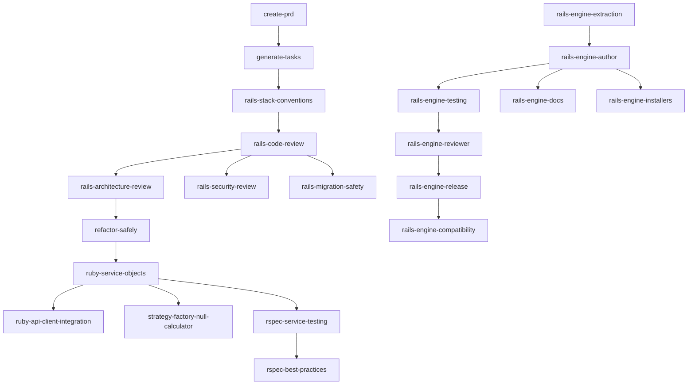

# My Best Practices Skills (Rails Edition)

A curated library of AI agent skills for **Ruby on Rails** development. These skills provide specialized knowledge, conventions, and workflow patterns that AI coding assistants use to deliver higher-quality code.

## Platforms

Works with **Cursor**, **Codex**, and **Claude Code**.

| Platform | Installation |
|----------|-------------|
| **Cursor** | Symlink or clone to `~/.cursor/skills/` |
| **Codex** | See [`.codex/INSTALL.md`](.codex/INSTALL.md) |
| **Claude Code** | Install as plugin via `.claude-plugin/` |

See [docs/implementation-guide.md](docs/implementation-guide.md) for detailed setup instructions.

## Quick Start

### Cursor

```bash
# Option A: Symlink (if you already have the repo cloned)
ln -s /path/to/my-cursor-skills ~/.cursor/skills-cursor/my-cursor-skills

# Option B: Clone directly
git clone <your-repo-url> ~/.cursor/skills-cursor/my-cursor-skills
```

### Codex

```bash
git clone <your-repo-url> ~/.codex/my-cursor-skills
mkdir -p ~/.agents/skills
ln -s ~/.codex/my-cursor-skills ~/.agents/skills/my-cursor-skills
```

### Claude Code

```bash
# From the Claude Code interface, add as a plugin:
/add-plugin /path/to/my-cursor-skills
```

## Skills Catalog

### Planning & Tasks

| Skill | Description |
|-------|-------------|
| [create-prd](create-prd/) | Generate Product Requirements Documents from feature descriptions |
| [generate-tasks](generate-tasks/) | Break down PRDs into step-by-step implementation task lists |

### Rails Code Quality

| Skill | Description |
|-------|-------------|
| [rails-code-review](rails-code-review/) | Review Rails code following The Rails Way conventions |
| [rails-architecture-review](rails-architecture-review/) | Review application structure, boundaries, and responsibilities |
| [rails-security-review](rails-security-review/) | Audit for auth, XSS, CSRF, SQLi, and other vulnerabilities |
| [rails-migration-safety](rails-migration-safety/) | Plan production-safe database migrations |
| [rails-stack-conventions](rails-stack-conventions/) | Apply Rails + PostgreSQL + Hotwire + Tailwind conventions |
| [rails-background-jobs](rails-background-jobs/) | Design idempotent background jobs with Active Job / Solid Queue |

### Ruby Patterns

| Skill | Description |
|-------|-------------|
| [ruby-service-objects](ruby-service-objects/) | Build service objects with .call, standardized responses, transactions |
| [ruby-api-client-integration](ruby-api-client-integration/) | Integrate external APIs with the layered Auth/Client/Fetcher/Builder pattern |
| [strategy-factory-null-calculator](strategy-factory-null-calculator/) | Implement variant-based calculators with Strategy + Factory + Null Object |

### Testing

| Skill | Description |
|-------|-------------|
| [rspec-best-practices](rspec-best-practices/) | Write maintainable, deterministic RSpec tests with TDD discipline |
| [rspec-service-testing](rspec-service-testing/) | Test service objects with instance_double, hash factories, shared_examples |

### Rails Engines

| Skill | Description |
|-------|-------------|
| [rails-engine-author](rails-engine-author/) | Design and scaffold Rails engines with proper namespace isolation |
| [rails-engine-testing](rails-engine-testing/) | Set up dummy apps and engine-specific specs |
| [rails-engine-reviewer](rails-engine-reviewer/) | Review engine architecture, coupling, and maintainability |
| [rails-engine-release](rails-engine-release/) | Prepare versioned releases with changelogs and upgrade notes |
| [rails-engine-docs](rails-engine-docs/) | Write comprehensive engine documentation |
| [rails-engine-installers](rails-engine-installers/) | Create idempotent install generators |
| [rails-engine-extraction](rails-engine-extraction/) | Extract host app code into engines incrementally |
| [rails-engine-compatibility](rails-engine-compatibility/) | Maintain cross-version compatibility |

### Refactoring

| Skill | Description |
|-------|-------------|
| [refactor-safely](refactor-safely/) | Restructure code with characterization tests and safe extraction |

### Meta

| Skill | Description |
|-------|-------------|
| [using-my-skills](using-my-skills/) | Discover and invoke the right skill for the current task |

## Skill Relationships



## How Skills Work

Each skill is a `SKILL.md` file in its own directory. Skills follow a consistent structure:

1. **YAML Frontmatter** — `name` and `description` (triggers for skill discovery)
2. **Quick Reference** — Scannable table at the top
3. **Core Rules / Process** — The main instructions
4. **HARD-GATE** — Non-negotiable blockers (where applicable)
5. **Common Mistakes** — "Mistake vs Reality" table
6. **Red Flags** — Signals something is going wrong
7. **Integration** — Related skills and when to chain them

See [docs/architecture.md](docs/architecture.md) for the full conventions spec.

## Typical Workflows

| Workflow | Skill Chain |
|----------|-------------|
| **New feature** | create-prd -> generate-tasks -> rails-stack-conventions -> rspec-best-practices -> rails-code-review |
| **Code review** | rails-code-review + rails-security-review + rails-architecture-review |
| **New engine** | rails-engine-author -> rails-engine-testing -> rails-engine-docs -> rails-engine-installers |
| **Refactoring** | refactor-safely -> rspec-best-practices -> rails-code-review |
| **New service** | ruby-service-objects -> rspec-service-testing |
| **API integration** | ruby-api-client-integration -> rspec-service-testing |

## Creating New Skills

See [docs/skill-template.md](docs/skill-template.md) for the template and conventions.
