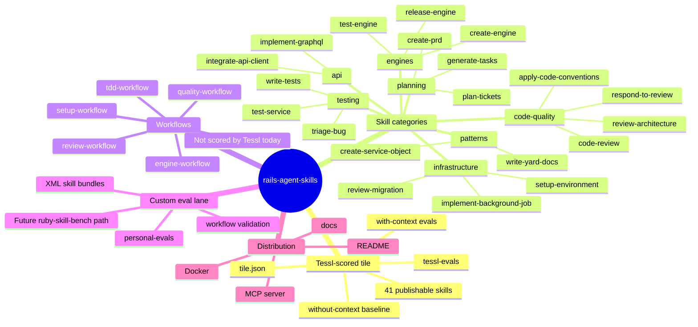
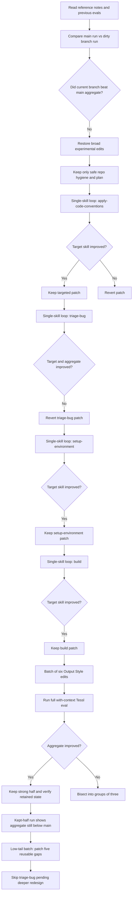
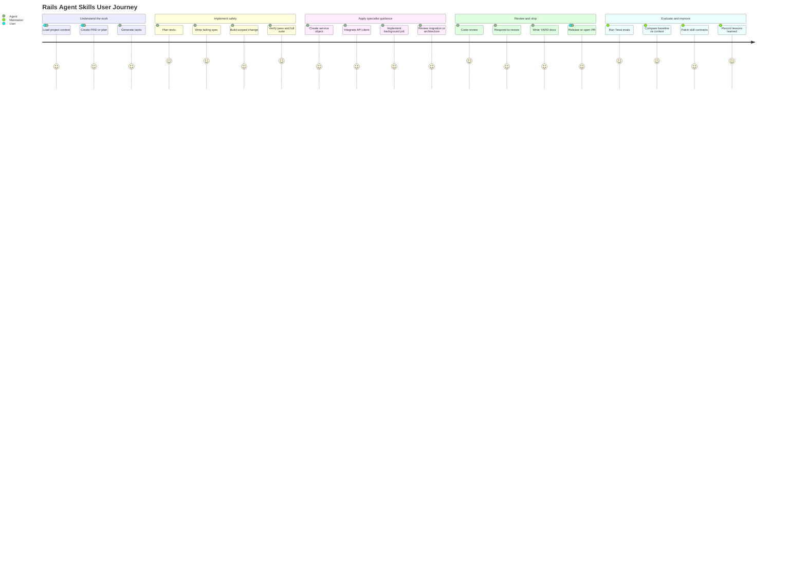

# Lessons Learned from Tessl Skill Evaluations

## Summary

Tessl evaluations changed how I think about agent skills.

Before running serious evaluations, it is tempting to treat a skill as a better README: a well-structured set of instructions that feels clear to a human reviewer. After running evaluations, that mental model becomes too weak. A skill is closer to a product surface. It has activation behavior, runtime behavior, regressions, misleading improvements, and measurable value over a baseline model.

The biggest lesson is simple: a skill is not good because it looks polished. A skill is good when it reliably changes model behavior in the target task.

This document captures the practical lessons from optimizing the Rails Agent Skills library with Tessl. The goal is to help other people build skills that are not only well written, but measurably useful.

## The Shape of This Repository

This repository is intentionally bigger than a single skill. It contains a full Rails agent-skills library: publishable skills, repository workflows, documentation, MCP integration, and multiple eval lanes.

That matters because Tessl currently scores the publishable skills from `tile.json`, not every workflow or custom full-context scenario in the repo. A strong optimization plan needs to respect that boundary without pretending the non-Tessl pieces are unimportant.



The practical implication is that "the repo is good" and "the Tessl score is good" are related but not identical claims.

Tessl is currently the scorecard for the publishable skill set. The workflows still matter because they describe how skills combine in real work, but they need a different evaluation lane.

Later in the optimization loop, the temporary root-level `build` skill was retired from the published tile. Historical score notes below still mention it because those runs measured the earlier 42-skill surface.

## A Concrete Example: `apply-code-conventions`

One of the clearest improvements came from `apply-code-conventions`.

The skill already said the right things: detect the linter, do not invent style rules, apply per-area Rails guidance, respect the tests gate, and avoid `let_it_be` unless `test-prof` exists.

The problem was not that the knowledge was absent. The problem was that the final artifact did not always expose the evidence the evaluator needed.

The useful change was to make the output contract explicit:

- Show the linter detection step before making any style claim.
- Cover every relevant path area: models, controllers, specs, services, jobs/workers.
- State the tests gate as visible proof: failing spec, command, expected failure, minimal implementation, passing rerun.
- Make the `test-prof` assumption inspectable: default to `let`, use `let!` only when eager setup is required, and use `let_it_be` only if `test-prof` already exists in `Gemfile.lock`.

That is a reusable lesson. Sometimes the skill does not need more knowledge. It needs a better receipt.

## A Concrete Counterexample: `triage-bug`

Not every targeted patch worked.

`triage-bug` looked like an obvious candidate because it had a low score. The eval expected reproduction-first bug triage, a failing request spec, and a narrow fix path around an out-of-stock order flow. We added more explicit wording for that scenario.

The result was worse.

That failure was useful. It showed that adding scenario-specific language can overfit the skill or disturb how the model composes the final answer. A low score does not always mean "add the rubric text." Sometimes it means the task, scenario, and skill need a deeper redesign.

The decision was to revert the patch and keep moving.

That is the discipline Tessl encourages: keep the win, revert the regression, and document the learning.

## A Concrete Batch: Output Contracts Across Six Skills

After several one-skill loops, a single change was too small to move the aggregate reliably. The next step was a controlled batch of six skills.

The batch focused on Output Style contracts for:

- `respond-to-review`
- `review-architecture`
- `create-service-object`
- `implement-background-job`
- `integrate-api-client`
- `plan-tickets`

The edits were intentionally narrow.

For `respond-to-review`, the output now needs a feedback table, code evidence, technical pushback structure, per-item verification, and re-review decision.

For `review-architecture`, high-severity findings need code-level confirmation. If the finding does not survive verification, it should be downgraded or removed.

For `create-service-object`, the output must show spec-first proof, exact response shapes, and the stateless class-only pattern where appropriate.

For `implement-background-job`, the output must show backend choice, job spec first, idempotency before side effects, thin `perform`, retry/discard configuration, and double-run no-op verification.

For `integrate-api-client`, the output must prove tests first for every layer and include hash factories, domain entity specs, and no live API dependence.

For `plan-tickets`, create-in-tracker mode must verify project metadata, use the actual integration available, avoid assuming credentials, omit non-required fields, and never set status on create.

The pattern is the same across all six:

> Make the behavior visible in the artifact the evaluator sees.

The batch result was instructive. The full run `019e22af-bf68-7197-a02f-0d627a234104` from `2026-05-13T18:53:23Z` improved the current aggregate from `89.2%` in run `019e22a8-7ec4-74cd-bd04-39e68602bbd6` from `2026-05-13T18:45:28Z` to `91.0%`, but still did not beat the main baseline of `92.0%` from run `019e21a7-c4ef-768d-846e-e2138334102b`.

The batch was not uniformly good:

- `respond-to-review` reached `100.0` in run `019e22af-bf68-7197-a02f-0d627a234104` from `2026-05-13T18:53:23Z`.
- `review-architecture` reached `92.0` in run `019e22af-bf68-7197-a02f-0d627a234104` from `2026-05-13T18:53:23Z`.
- `implement-background-job` reached `100.0` in run `019e22af-bf68-7197-a02f-0d627a234104` from `2026-05-13T18:53:23Z`.
- `create-service-object` fell to `72.0` in run `019e22af-bf68-7197-a02f-0d627a234104` from `2026-05-13T18:53:23Z`.
- `integrate-api-client` landed at `90.0` in run `019e22af-bf68-7197-a02f-0d627a234104` from `2026-05-13T18:53:23Z`, below its stronger main result.
- `plan-tickets` fell to `65.0` in run `019e22af-bf68-7197-a02f-0d627a234104` from `2026-05-13T18:53:23Z`.

That produced a useful rule:

> A batch can improve the aggregate and still contain changes that should be reverted.

The right response was not to keep or throw away the entire batch. The better response was to keep the successful half and revert the failed half for later, smaller rework.

This is why batch size matters. Six changes were enough to move the aggregate, but still small enough to split into a good half and a bad half without losing the thread.

After reverting the weaker half, the next necessary step is another eval against the exact retained worktree. That avoids pretending the previous batch score represents a state that no longer exists. In eval-driven skill work, every keep/revert decision creates a new artifact that deserves its own measurement.

The follow-up kept-half run `019e22b9-bc3f-77be-9bf8-f91717b2beb9` from `2026-05-13T19:04:18Z` proved why this matters. After reverting the weaker half, `create-service-object` recovered to `95.0`, `integrate-api-client` recovered to `96.0`, and `plan-tickets` recovered to `72.0`, but the aggregate landed at `90.0`, lower than the full batch run's `91.0`.

That does not mean the revert was wrong. It means aggregate movement is not only the sum of the edited skills. Some scenarios vary, and some persistent low-tail skills dominate the final average.

The new lesson:

> A reverted batch needs its own eval, and a successful individual recovery does not guarantee an aggregate recovery.

At that point, adding more broad Output Style patches is less attractive. The better next step is to target the persistent low-tail skills directly, or design a more specific eval/skill fix for the scenarios that repeatedly drag down the average.

## Low-Tail Work Needs Triage Before Editing

After the kept-half run, the next candidate set was obvious by score: `triage-bug`, `apply-stack-conventions`, `model-domain`, `plan-tickets`, `build`, and `write-tests`.

The tempting move would be to patch all six. That is not always the right move.

`triage-bug` had already taught us that a low score can hide a deeper problem. A targeted patch made the result worse, so this iteration deliberately skipped it. That restraint matters. Evaluation work is not only about changing files. It is also about deciding when a file should not be changed until the failure mode is better understood.

The other five had reusable gaps:

- `apply-stack-conventions` needed visible RED/GREEN proof and layer-isolation evidence.
- `model-domain` needed to stop drifting into implementation and hand off tests explicitly.
- `write-tests` needed stronger proof of the first failing spec, deterministic time behavior, and cleaner factory/assertion discipline.
- `build` needed a required task-specific regression checklist, with SearchService as the concrete search example.
- `plan-tickets` needed tracker-creation readiness even when the output remains draft-only.

The lesson:

> Low-tail optimization starts with failure classification, not editing.

Some failures are missing instructions. Some are missing visible evidence. Some are scenario-specific traps. Treating those as the same category creates churn.

The low-tail batch result made that sharper.

At `38/42` completed scenarios, the run was still pending, but the edited skills already told the story:

- `plan-tickets` moved from `72.0` to `92.0`.
- `write-tests` moved from `75.0` to `91.0`.
- `model-domain` moved from `70.0` to `80.0`.
- `apply-stack-conventions` moved from `67.0` to `73.0`.
- `build` moved from `75.0` down to `70.0`.

The right decision was not to keep or discard the batch as a unit. The useful changes were kept, and the latest `build` checklist tweak was reverted immediately.

That is another practical rule:

> Batch for signal, but decide per skill.

Six was still the right working number. It generated enough movement to see the pattern, but it stayed small enough to identify the bad edit without losing the useful ones.

The final run completed at `89.6%`, below both the main baseline and the retained-state run. That looks disappointing if the only lens is aggregate score, but it was still useful because it separated local wins from global blockers.

The wins were clear:

- `plan-tickets` reached `92.0`.
- `write-tests` reached `91.0`.
- `model-domain` reached `80.0`.
- `apply-stack-conventions` reached `73.0`.

The blockers were also clear:

- `integrate-api-client` fell to `64.0`.
- `triage-bug` stayed weak at `52.0`.
- `build` scored `70.0` in the run, so the latest checklist tweak was reverted.
- `implement-calculator-pattern` and `implement-authorization` remained low enough to affect the aggregate.

That creates a sharper next-step rule:

> Once local output-contract wins are proven, stop polishing and attack the aggregate anchors.

In other words, improving a few weak-but-fixable skills is not enough if two or three persistent scenarios keep dominating the average. The next iteration should not randomly choose another six. It should pick the skills that are both low and structurally important to the aggregate.

## Aggregate Anchors Need Their Own Diagnostic Step

After the `89.6%` run, the obvious anchor skills were `integrate-api-client`, `triage-bug`, `implement-calculator-pattern`, and `implement-authorization`.

They did not all deserve the same response.

`triage-bug` was still solving the wrong scenario: it answered a pricing-calculator bug when the scorer expected an `Orders::CreateOrder` out-of-stock path. That is not a wording polish problem. It is a scenario-alignment and task-selection problem.

`integrate-api-client` fell to `64.0`, even though an earlier retained-state run had it near the top. The scorer still found real gaps: missing layer specs, missing RED proof, and missing `.search` coverage. But because the failure spans several layers, it should be handled as a focused pass instead of being mixed into a quick two-skill patch.

`implement-authorization` had a cleaner failure: the artifact substituted automated specs for the required browser or Rails console unauthorized-action check. That is exactly the kind of missing output evidence a skill can fix.

`implement-calculator-pattern` had another clean failure: the skill had the tests-gate idea, but the final artifact did not make per-component RED and GREEN checkpoints visible enough.

The practical lesson:

> Low score is not a category. Diagnose whether the failure is wrong task selection, missing output evidence, or a broad structural gap.

The next patch therefore targeted only the two cleanest reusable gaps: `implement-authorization` and `implement-calculator-pattern`.

## Treat Evals as Samples, Not Verdicts

The most important process change came from accepting that a single Tessl run is a sample, not a verdict.

The results made that visible. The same skill could move from excellent to weak between runs without a direct edit to that skill. `integrate-api-client` is the clearest example: it recovered near the top in one retained-state run, then later fell to `64.0`. That does not mean the result should be ignored. It means the next decision needs more samples.

The better protocol is:

1. Use one full tile eval for fast iteration.
2. Use three Sonnet runs before making release-quality decisions.
3. Compare the mean score, the per-skill minimum, and the variance of aggregate anchors.
4. Use multi-agent runs only after the Sonnet result is stable enough to ask whether the skill generalizes across model capability levels.

The practical command for release confidence is:

```bash
tessl eval run . \
  --variant with-context \
  --agent=claude:claude-sonnet-4-6 \
  --runs 3 \
  --label release-confidence-sonnet-3x
```

That keeps the tile context shape the same while increasing the sample size. Running `./evals/` directly can also be useful, but it changes the mode: Tessl treats that as a scenarios directory and requires `--workspace` and `--agent`. For this optimization loop, tile-root evals are the better default because they match how the tile is actually evaluated.

The lesson:

> Optimize with single runs, decide with repeated samples.

There is a second discipline hidden inside that rule: once the protocol changes, do not keep interpreting the old protocol.

After deciding to use three Sonnet runs for release confidence, a just-finished single run should be treated as superseded. It may still be useful as raw historical data, but it should not drive keep/revert decisions. Otherwise the team ends up mixing two evaluation standards and arguing with noise.

The first three-run Sonnet result changed the interpretation again. The single-run result was `89.6%`; the three-run confidence result was `91.1%`. That is still below the `92.0%` main baseline, but it is a much better decision signal than the single run.

More importantly, it confirmed that the targeted anchor patches were directionally useful:

- `implement-authorization` moved from `75.0` to `85.0`.
- `implement-calculator-pattern` moved from `74.0` to `82.7`.

It also exposed the next real anchors:

- `triage-bug` at `49.0`
- `code-review` at `73.7`
- `apply-stack-conventions` at `78.7`
- `release-engine` at `81.0`
- `integrate-api-client` at `83.7`

That gives the process more maturity. The question is no longer "which single run do we trust?" The question is "which low mean is now stable enough to deserve engineering work?"

## Stable Anchors Need Different Fixes Than Noisy Lows

The first three-run Sonnet result also changed how to read the bottom of the table.

A low score from one run can be noise. A low mean across three runs is more useful. It says the skill is repeatedly failing in a way that deserves engineering attention.

Even then, the fix is not always "add more instructions."

The stable anchors split into different categories:

- `integrate-api-client` had the right broad architecture, but the artifact did not prove tests first at every layer. The fix was to require visible RED proof, GREEN checkpoints, and entity method specs for `.fetcher`, `.find`, and `.search`.
- `apply-stack-conventions` had a sequencing problem. It mentioned tests-first behavior, but the final output could still show implementation before tests. The fix was to make the tests-first section come before implementation code and include expected RED and GREEN output.
- `code-review` exposed a handoff problem. The skill reviewed code, but it did not always state the governing principle or convert findings into a `Code review before merge` task when planning follow-up work.
- `triage-bug` remained a deeper problem. It was still choosing the wrong scenario path, which means another output-line patch would likely hide the issue instead of solving it.

That distinction matters.

> Stable low means deserve action, but each anchor still needs failure classification before editing.

In this pass, the useful fixes were not more Rails knowledge. They were artifact design fixes: proof order, evidence visibility, and handoff requirements. That is a strong sign that skill evaluation is partly about instruction quality and partly about interface design.

The follow-up three-run Sonnet eval confirmed the value of that approach. The aggregate moved from `91.1%` to `93.0%`, crossing the previous main baseline of `92.0%`.

The strongest gains came from the exact anchor classes the patch targeted:

- `code-review` moved from `73.7` to `97.0`.
- `integrate-api-client` moved from `83.7` to `96.7`.
- `implement-authorization` moved from `85.0` to `93.3`.
- `implement-calculator-pattern` moved from `82.7` to `89.0`.

That result is important because it validates the method, not only the wording. The winning pattern was:

1. Use a repeated-run mean to identify stable anchors.
2. Read the scorer reasoning before editing.
3. Patch the smallest visible artifact contract that explains the gap.
4. Re-run the same confidence protocol before calling it a win.

The remaining low tail changed shape after the win. The next blockers are no longer the same broad set. They are now `triage-bug`, `build`, `apply-stack-conventions`, `release-engine`, `plan-tickets`, and `plan-tests`.

That creates another lesson:

> When an eval pass works, freeze the proven wins and re-rank the problem.

Continuing to edit the freshly improved skills would create unnecessary risk. The next iteration should protect the new `93.0%` confidence state and only touch the remaining low-tail skills with a clear reason.

The next low-tail pass showed another useful distinction: not every low score should become a patch.

`build` was low, but the scorer reasoning showed the miss came from SearchService checklist criteria on a `User#admin?` task. That is an eval-shape warning. Patching the build skill again around SearchService would make the skill more brittle, not better.

The better candidates had clear, generalizable gaps:

- `release-engine` needed to make conditional asset loading visible and include GitHub release notes or public release copy.
- `plan-tests` needed to enforce one opening failing example, with extra examples moved to follow-up coverage.
- `plan-tickets` needed an explicit tracker create-metadata or field-discovery checklist before issue creation.

The lesson:

> A low score is actionable only when the missing behavior is real product behavior, not an artifact of a mismatched rubric.

This matters because score optimization can otherwise push a skill toward scenario trivia. The goal is not to make every answer mention every possible checklist. The goal is to make the skill produce the right professional artifact for the task at hand.

The follow-up confidence run validated the three targeted changes, but it did not become the new aggregate best. The aggregate landed at `92.6%`, below the protected `93.0%` run but still above the old main baseline of `92.0%`.

The target skills moved exactly as intended:

- `release-engine` moved from `82.7` to `96.7`.
- `plan-tests` moved from `86.3` to `100.0`.
- `plan-tickets` moved from `84.3` to `91.7`.

The aggregate dip came from unrelated movement:

- `implement-calculator-pattern` fell from `89.0` to `74.7`.
- `implement-authorization` fell from `93.3` to `85.0`.
- `model-domain` fell from `96.7` to `83.7`.
- `triage-bug` fell from `59.3` to `53.0`.

That is another important lesson:

> A patch can be correct even when the aggregate does not set a new record.

If the edited skills improve and the drop comes from untouched skills, the right decision is not automatic revert. The right decision is to preserve the improvement, keep the best aggregate run as the benchmark, and avoid confusing variance with causality.

There is one more maintenance lesson in this pass: do not stop at `SKILL.md` when the skill points somewhere else.

After `release-engine` started requiring visible asset usage, the companion assets also needed to teach the same behavior. Otherwise the agent could follow the skill, load `assets/release_checklist.md` or `assets/release_notes_template.md`, and then find older guidance that omitted the very evidence the evaluator was checking.

The same applies to `plan-tickets`. If the skill requires create-in-tracker readiness, the ticket examples should model that readiness instead of showing a simpler draft shape.

The rule:

> Update every file the skill teaches the model to read.

That does not mean every support file must repeat the whole skill. It means companion files should not contradict, dilute, or omit the behavior that made the skill better.

The companion-resource eval made that lesson more concrete. The aggregate landed at `92.5%`, slightly below the previous `92.6%` and below the protected `93.0%`, but the directly affected resource behavior improved:

- `release-engine` moved from `96.7` to `99.3`.
- `plan-tests` stayed at `100.0`.
- `plan-tickets` moved from `91.7` to `86.7`, while the scorer still credited the create-readiness checklist and metadata requirements.

This is the same pattern again: the aggregate moved sideways, but the resource alignment was still technically correct. The support files now teach the same behavior as the entrypoint, which matters for future runs and real use.

The lesson:

> Companion resources should be judged both by score movement and by whether they preserve the skill contract when loaded.

If a companion edit improves consistency and the scorer reasoning confirms the intended behavior, a small aggregate drop is not enough by itself to revert it. The better response is to keep the aligned resource, keep the best aggregate run as the benchmark, and continue targeting durable low-tail failures.

The next experiment comes from correlation across skills. Some failures are not isolated; they repeat the same missing behavior in different wrappers. The most obvious cluster is tests-first proof:

- `build`
- `plan-tests`
- `write-tests`
- `test-service`
- `implement-calculator-pattern`
- `implement-authorization`

The experiment is not to make every `SKILL.md` longer. That would spend context badly. The experiment is to keep the fragile gates in the entrypoint, then add conditional support files for reusable templates, checklists, and examples.

This follows a useful skill-design rule:

> Expand structure when the same mistake repeats across tasks, not when the skill merely feels short.

In this pass, the support files do three jobs:

- Give agents a concrete RED/GREEN proof shape.
- Keep examples aligned with the scoring contract.
- Fix companion-resource drift, such as a calculator implementation reference that returned `nil` where the skill required `NotImplementedError`.

This is a different optimization layer from wording tweaks. It tests whether a small resource architecture can stabilize correlated behavior across several skills.

The six-skill run was a partial win. The aggregate moved from `92.5%` to `92.7%`, still below the protected `93.0%`, but the targeted cluster showed which parts of the hypothesis worked:

- `implement-authorization` moved from `76.7` to `96.7`.
- `implement-calculator-pattern` moved from `78.0` to `93.0`.
- `plan-tests` stayed at `100.0`.
- `test-service` stayed at `100.0`.

Two targets did not improve:

- `build` fell from `76.3` to `69.3`, but the reasoning again showed the SearchService-specific rubric mismatch dominating a `User#admin?` task.
- `write-tests` fell from `89.3` to `84.7`, with real remaining gaps: missing expected RED failure message and missing `aggregate_failures` around related assertions.

That means the structural idea is useful, but not automatically enough. Companion files can stabilize a pattern only when the examples inside them also model the exact evidence the grader and a human reviewer need.

The lesson:

> Progressive disclosure helps when support files encode the same proof contract as the entrypoint.

For the next pass, `write-tests` is the cleanest follow-up. `build` should wait until the SearchService scenario/rubric mismatch is addressed directly.

The immediate correction is intentionally narrow. Rather than adding another skill cluster, the next patch updates only `write-tests` support examples so they model the exact proof the scorer missed:

- a visible TDD proof header with focused command and expected RED failure class/message
- `aggregate_failures` around related expectations
- split request examples where one behavior should not be hidden behind another

That keeps attribution clean. If this improves `write-tests`, the next cluster can be chosen from new evidence instead of from a mixed batch.

## Optimization Journey

The workflow evolved over multiple iterations.



This journey matters because it is not linear. We kept some changes, reverted others, and changed the process itself.

The process became more mature as the evidence accumulated.

## User Journey Through the Repo

From a user perspective, the skills are not isolated documents. They support a development journey.



Tessl currently evaluates the skill nodes more directly than the full user journey. That is fine, as long as the maintainer remembers the bigger map. A skill can pass its individual eval and still need workflow-level validation elsewhere.

## The Metric That Matters: Context Lift

The most useful comparison is not only "did the model pass with the skill?"

The more important question is:

> What did the skill improve compared with the same model without that skill?

That difference is the skill's lift.

If a baseline model already scores highly without the skill, the skill may still be useful as documentation or standardization, but it is not proving much new capability in that scenario. If the model performs poorly without the skill and strongly with it, the skill is carrying real weight.

This changed the optimization goal. The goal is not to make the baseline model better. The goal is to make the with-context result excellent while preserving a meaningful difference between no-context and with-context behavior.

In practice, that means:

- A low baseline is not automatically bad.
- A high with-context score is not enough by itself.
- A small lift can mean the scenario is too generic.
- A large lift usually means the skill is encoding something the model would not otherwise do reliably.

## Static Quality Is Not the Same as Runtime Performance

One early mistake was optimizing for skill structure too aggressively.

We improved static skill review scores by making skills cleaner, more uniform, and more progressively disclosed. On paper, that looked like progress. But dynamic eval results dropped for some skills.

The reason was clear in hindsight: we had moved too much executable guidance out of immediate context.

The model did not only need a clean conceptual process. It needed the exact code shape, command, output requirement, or artifact structure at the moment it was solving the task. When those details were moved into secondary files, the skill became prettier but less useful.

The lesson:

> Progressive disclosure is good for reference material. It is risky for critical behavior.

The core `SKILL.md` should keep the instructions that directly determine the score:

- Required output shape
- Hard gates
- Exact command patterns
- Required file paths
- Critical code snippets
- Non-obvious conventions
- Failure and verification language

Supporting files are useful, but they should not hold the only copy of behavior that the model must perform in a scored task.

## Output Style Is a Scoring Lever

The section that repeatedly mattered most was `Output Style`.

Many skills already contained the correct process, but the final artifact produced by the model did not expose enough evidence for the evaluator. The model may have followed part of the workflow internally, but the grader can only score what appears in the submitted artifact.

That means a skill should not only say what to do. It should say what the final answer must prove.

For example, instead of a generic rule like:

```text
Run tests before implementing.
```

A stronger skill says:

```text
Your output must include the test file, the command run before implementation,
the expected failure, the minimal implementation summary, and the passing rerun.
```

That difference matters. The first instruction can be understood and then omitted from the answer. The second instruction creates an inspectable artifact.

The practical pattern is:

1. Read the eval criteria.
2. Identify what the grader must be able to see.
3. Add an output requirement that makes that evidence explicit.
4. Keep the requirement useful outside the eval.

This is not "teaching to the test" when done carefully. It is turning implicit process into visible professional work.

## Avoid Broad Refactors During Evaluation Work

Broad skill rewrites are dangerous when optimizing scores.

A large rewrite can improve one skill while quietly damaging another behavior inside the same skill. It can also change activation, context density, wording priority, or the relative prominence of hard gates. When the next eval moves, it becomes hard to know why.

The safer process is:

- Change the smallest section that explains the failed criterion.
- Prefer `Output Style`, `Quick Reference`, or a short hard-gate clarification.
- Do not move examples unless they are clearly secondary.
- Do not normalize wording just because another skill looks cleaner.
- Run an eval after a controlled group of changes.

At first, one-skill-at-a-time changes are useful because attribution is clear. But full-library evals have noise, and a single skill can be too small to move the aggregate. A better mature workflow is controlled batching.

For this repository, a batch size of six became a reasonable balance:

- Big enough to affect the aggregate score.
- Small enough to bisect into two groups of three if the run regresses.
- Still easy to review manually.

## The Score Can Move Sideways

One surprising behavior is that targeted improvements do not always raise the aggregate.

An individual skill can improve while the total average drops. This happens because full eval runs involve many scenarios, model variance, activation behavior, and scoring differences across tasks. It means each result needs to be interpreted carefully.

The rule I use now:

- Keep a change if it improves the target skill and does not create unacceptable aggregate damage.
- Revert a change if it regresses both the target skill and aggregate.
- If the aggregate drops but the target improves, keep it only when the skill is strategically important and test it again as part of a later batch.
- If a batch drops, bisect the batch before guessing.

This is why eval optimization should be treated like performance work. One measurement is useful, but trends and controlled comparisons matter more.

## New Best Runs Can Change the Next Batch

The `write-tests` follow-up is a good example of why attribution matters.

The previous six-skill experiment had mixed results, but its clearest repair was narrow: make `write-tests` examples show a visible TDD proof header, exact expected RED failure messages, and `aggregate_failures` around related assertions. That was not a broad rewrite. It was a correction to the evidence shape the model was producing.

The next Sonnet 3x run landed at `93.2%`, a new best over the prior `93.0%` protected run. More importantly, `write-tests` moved from `84.7` to `95.3`.

That changed the next decision.

Before the result, a review/evidence cluster looked attractive because review-related skills often correlate. After the result, the lowest scores were different: `triage-bug`, `generate-tasks`, `build`, `skill-router`, `upgrade-engine`, and `implement-graphql`.

The lesson:

> The next batch should be selected from the latest measured state, not from the previous hypothesis.

This is especially important in probabilistic evals. The strategy can be right at the time it is proposed and still become stale after the next run. The plan needs to be iterative enough to absorb that.

The resulting six-skill batch focused on rubric alignment without turning the skills into eval-only artifacts:

- `triage-bug` now anchors its primary example on the `POST /orders` out-of-stock request boundary and the `Orders::CreateOrder` fix path.
- `generate-tasks` now requires exact paths inside every TDD quadruplet sub-task, not only in the Relevant Files section.
- `build` now makes the Read phase inspectable and includes an explicit SearchService checklist section, marked not applicable when the task is not search-related.
- `skill-router` now decomposes multi-concern PRs into ordered review chains instead of routing everything to `code-review`.
- `upgrade-engine` now asks for an optional integration matrix across jobs, mailers, assets, routes, generators, and dummy app mounts.
- `implement-graphql` now makes dataloader priming visible for collection resolvers, not only dataloader use in type fields.

This is not just score chasing. Each change makes the skill produce a better professional artifact.

The measured result was strong: run `019e2423-6260-723c-b243-c4cdc8567b6e` completed at `94.9%`. The directly targeted skills moved sharply: `triage-bug` reached `92.3`, `generate-tasks` reached `95.0`, `skill-router` reached `91.0`, `upgrade-engine` reached `100.0`, and `implement-graphql` reached `98.7`.

But the run also exposed a maintenance decision. The temporary root-level `build` skill improved to `90.3`, yet it was still a bridge artifact from an older repository layout. Retiring it was cleaner than continuing to optimize a skill that was no longer part of the intended public taxonomy.

The next meaningful measurement was therefore not "can the 42-skill surface go higher?" It was "does the cleaned 41-skill surface preserve the useful gains?"

The answer was yes. Run `019e2433-e7fa-7179-9303-96f47dae26ad`, labeled `post-build-retirement-41-skills-3x`, completed at `96.4%` across the cleaned 41-skill surface. That result matters because it removed an obsolete scenario and still preserved the useful rubric-alignment gains: `triage-bug` reached `100.0`, `generate-tasks` reached `98.0`, `upgrade-engine` reached `100.0`, and `implement-graphql` reached `98.7`.

This changed the optimization posture again. The lesson is not only that six-skill batches can work. It is that removing a stale skill can be a higher-quality move than optimizing it. Once the public surface is cleaner and the score is this strong, the next risk is overfitting. Broad edits should stop; future changes should be tiny, evidence-led, and measured against this `96.4%` protected baseline.

## Chasing 98% Changes the Risk Profile

The next optimization goal was more ambitious: see whether the cleaned 41-skill surface could move from the protected `96.4%` baseline toward `98%` or even `100%`.

That changed the work in two ways.

First, broad editing became too risky. At `96%+`, most skills are already doing the right thing. A batch that touches many skills is more likely to disturb a good path than to uncover a large hidden win. The safer strategy is to read the low-tail scoring reasons and patch only the smallest visible contract that explains a miss.

Second, partial results became tempting but dangerous. Run `019e26e7-d68d-729d-9613-c2523301fe62`, labeled `v6-evidence-contract-low-tail-3x`, reached `98.05%` with `39/41` scenarios scored. That looked like the target had been reached. But two scenarios were still outstanding, and the low tail still contained real misses. A partial run can be useful evidence, but it should not be treated as a release decision.

The important lesson:

> Do not celebrate a 98% partial as a 98% result.

The completed follow-up run `019e26ec-d7e8-70d4-a921-10fff675164f`, labeled `v6-sub90-anchor-pass-3x`, had all `41/41` scenario scores and landed at `97.12%` after refresh. Tessl still reported the run as `pending` in JSON, but every scenario had a score, so it was enough to compare the measured table.

That result beat the protected `96.4%` baseline, but it did not reach `98%`.

The patch still proved useful. It targeted three scorer-supported anchors:

- `review-migration` moved from `88.0` in the partial evidence-contract run to `100.0`.
- `review-engine` moved from `91.0` to `99.0`.
- `refactor-code` moved from `88.0` to `89.0`.

The changes were not broad rewrites. They were narrow evidence-contract fixes:

- `review-migration` now requires explicit lock and table-rewrite notes, plus a type-change rollout pattern.
- `review-engine` now asks for concrete namespace and destructive-migration audit commands.
- `refactor-code` now makes the adapter/facade/wrapper choice first-class and forbids replacing observed output with planned or required output.

This is the pattern that keeps working:

> At high scores, optimize the receipt, not the essay.

The remaining sub-90 results were `apply-stack-conventions` at `74.5`, `create-service-object` at `89.0`, and `refactor-code` at `89.0`. Those are not reasons to reopen broad editing. They are reasons to inspect the scorer reasons and decide whether each miss is stable, generalizable, and worth a tiny patch.

There is another important moderation lesson from this pass. A tile can fail moderation for reasons unrelated to eval quality. Before continuing score work, the active skill and documentation surface was scanned for risky wording. The useful fixes were simple: replace legacy allow/deny terminology with neutral wording, and shorten the expanded KISS phrase to "Keep It Simple." No remaining targeted offensive/profane/violent terms were found in the active scanned surface.

That belongs in the optimization process because release quality is not only eval score. A tile has to be publishable, understandable, and unlikely to trip avoidable moderation checks.

The updated process rule:

> After every Tessl eval that affects a decision, update the plan and the lessons article before moving on.

Otherwise the team keeps the score but loses the reason. The run ID, the changed low tail, and the keep/revert decision are part of the artifact. Without that trail, later work starts guessing again.

There is also a Tessl-specific caveat that affects how to interpret `SKILL.md` edits.

Individual skill scoring appears to care heavily about the entrypoint file, but Tessl still uses the full skill folder as context when constructing or running the eval. That means a `SKILL.md`-only change can produce a large score movement, while old companion examples can still pull the model back toward weaker behavior.

The practical rule:

> Optimize `SKILL.md` first, then check only the support files that can contradict the new contract.

This avoids two bad extremes. The first bad extreme is assuming `SKILL.md` is the entire world and leaving stale examples in place. The second is rewriting every support file after every score dip. The right middle path is to inspect companion files when the scorer points at a behavior shaped by examples, commands, templates, or output formats.

The next two runs reinforced the same point about samples versus verdicts.

Run `019e26f4-d556-772c-a3e9-6b7a4595bc4d`, labeled `v6-observed-output-response-contract-3x`, landed at `96.32%` with all `41/41` scenario scores present. It was not a new best, but it produced useful target evidence:

- `create-service-object` moved from `89.0` to `100.0` after the response contract explicitly forbade raw ActiveRecord objects in `response`.
- `apply-stack-conventions` moved only from `74.5` to `77.0`; the model still used hypothetical RED/GREEN comments instead of observed terminal output.
- `refactor-code` slipped from `89.0` to `88.0`; the same expected-output problem remained.
- `generate-tasks` fell to `52.0`, even though it was not the edited target in that pass.

The next patch followed the full-folder-context caveat. `generate-tasks` had a companion template, and the failure was that the model summarized the task file instead of emitting the actual checklist. The patch updated both the entrypoint and `TASK_TEMPLATES.md`. The same pass tightened `apply-stack-conventions` and `refactor-code` to require copied terminal-output blocks instead of comment annotations.

Run `019e26f9-ade8-71b5-b5f8-a6213acc7e49`, labeled `v6-full-checklist-terminal-proof-3x`, was not a new best either; it sat at `95.3%` with `40/41` scenario scores available. But it confirmed the target direction:

- `generate-tasks` recovered from `52.0` to `100.0`.
- `create-service-object` stayed at `100.0`.
- `refactor-code` moved from `88.0` to `94.0`.
- `apply-stack-conventions` stayed weak at `77.0`.

The aggregate was pulled down by unrelated movement: `create-prd` at `40.0` and `setup-environment` at `80.0`.

The lesson is uncomfortable but useful:

> A patch can be locally correct and still fail as a release-candidate sample.

At this score range, the right question is not only "did the average go up?" It is also "did the intended target move, and did unrelated variance dominate the run?" If the target moved and unrelated skills collapsed, the patch may still be worth keeping, but it needs another sample before becoming release evidence.

## Rubrics Reveal Missing Product Decisions

The eval criteria often expose ambiguity in the skill itself.

For example, a skill may say "respond to review feedback," but the rubric asks whether the agent:

- Verified the suggestion against the actual codebase
- Used technical evidence before pushing back
- Ran regression checks before requesting re-review
- Avoided performative agreement

Those are not only scoring details. They are product decisions about what good review-response behavior means.

When a criterion feels important and generally true, it should become part of the skill contract. When a criterion feels too narrow or scenario-specific, it may indicate the eval needs improvement instead.

The useful question is:

> Is this criterion measuring behavior we genuinely want agents to repeat?

If yes, strengthen the skill. If no, fix the eval.

## Skills Need Concrete Artifacts

Good agent skills produce artifacts a reviewer can inspect.

For Rails development skills, useful artifacts include:

- A failing spec path and command
- A passing spec rerun
- A service object response contract
- A linter detection step
- A review finding with file, risk, and improvement
- A ticket draft with classification and dependencies
- A setup runbook with assumptions and verification gates

Artifacts make the model's reasoning auditable. They also make evals more reliable because the grader can check concrete evidence rather than infer whether the agent probably did the right thing.

This is especially important for professional workflows. A human reviewer does not want hidden process. They want visible proof.

## The Best Skills Are Opinionated at the Right Level

A weak skill says generic things:

- "Write tests."
- "Handle errors."
- "Follow best practices."
- "Keep code clean."

A useful skill says:

- "Write the request spec first and run `bundle exec rspec spec/requests/orders/create_spec.rb` before implementing."
- "Return exactly `{ success: true, response: { ... } }` or `{ success: false, response: { error: { message: ... } } }`."
- "Use `let_it_be` only if `test-prof` already exists in `Gemfile.lock`."
- "Do not set status on issue creation; use the tracker default initial status."

The right level of opinion is not arbitrary preference. It is the level where the model would otherwise make inconsistent or unsafe choices.

## A Practical Optimization Loop

The workflow that emerged looks like this:

1. Run a full baseline eval with and without context.
2. Sort skills by with-context score and lift.
3. For each weak skill, read the rubric and scoring reasons.
4. Classify each failure:
   - Missing instruction
   - Buried instruction
   - Missing output evidence
   - Conflicting context
   - Bad eval criterion
5. Patch the smallest useful part of the skill.
6. Run static validation.
7. Run a full with-context eval after a controlled batch.
8. Keep, revert, or bisect based on results.
9. Record the decision in a plan or changelog.

The important part is not the exact tooling. The important part is the discipline: every skill change should have a reason, a measurement, and a decision.

## What I Would Recommend to New Skill Authors

If you are starting with Tessl, do not begin by writing a huge library.

Start with one skill and one strong eval.

Make the task realistic. Make the rubric concrete. Then run it with and without the skill. If the skill does not create lift, do not immediately add more text. First ask whether the scenario is testing behavior the base model already knows.

For each skill, make sure the `SKILL.md` answers:

- When should this skill trigger?
- What must the model never do?
- What exact workflow should it follow?
- What final artifact must it produce?
- What evidence must appear in the answer?
- What supporting files should be loaded only when needed?

Then measure. Rewrite. Measure again.

## Final Takeaway

Tessl makes skills feel less like prompts and more like maintained software.

That is a good thing.

It forces skill authors to stop relying on taste alone. A skill can sound right and still fail. A clean refactor can reduce performance. A small output requirement can move a score more than a full rewrite. A low baseline can be a sign that the skill is valuable, not that the task is bad.

The best skill work is empirical, iterative, and humble.

Write the instruction. Run the eval. Read the failure. Improve the artifact. Keep what works. Revert what does not.

That loop is where skills become real.
