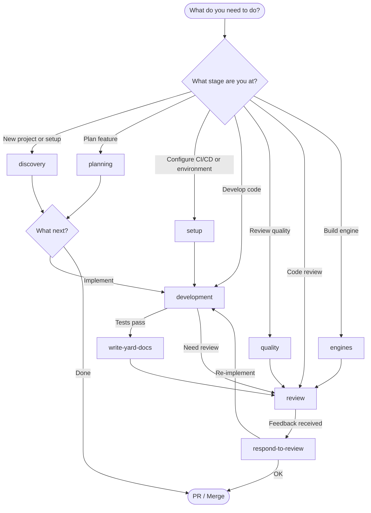

# Workflows — Rails Agent Skills

Step-by-step guides for each stage of Rails development. Each workflow is a chain of skills executed in order.

---

## Master Workflow Diagram



---

## Workflow Index by Stage

| Stage | Workflow | Description | Primary Skills |
|-------|----------|-------------|----------------|
| **Discovery** | [Discovery & Context](discovery.md) | Understand codebase, project onboarding | `load-context`, `setup-environment` |
| **Planning** | [Planning & Design](planning.md) | Plan features, PRD, tasks, DDD | `create-prd`, `generate-tasks`, `ddd skills` |
| **Setup** | [Setup & Configuration](setup.md) | Configure CI/CD, environment, deploy | `setup-environment` *(plus roadmap `setup-ci-cd`)* |
| **Development** | [Development](development.md) | TDD development, implementation | `plan-tests`, `testing skills`, implementation |
| **Quality** | [Code Quality](quality.md) | Conventions, refactoring, documentation | `apply-code-conventions`, `refactor-code`, `write-yard-docs` |
| **Review** | [Review & Validation](review.md) | Code review, security, architecture | `code-review`, `security-check`, `review-architecture` |
| **Engines** | [Engine Development](engines.md) | Create and maintain Rails engines | `engine skills` |

---

## Docs vs. Callable Workflow Skills

This directory contains **reference guides** describing each stage. For **executable orchestration**, use the callable workflow skills in `workflows/`:

| Stage Doc | Callable Skill | Status |
|-----------|----------------|--------|
| [development.md](development.md) | [`tdd`](../../workflows/tdd/SKILL.md) | Active |
| [review.md](review.md) | [`review`](../../workflows/review/SKILL.md) | Active |
| [setup.md](setup.md) | [`setup`](../../workflows/setup/SKILL.md) | Active |
| [quality.md](quality.md) | [`quality`](../../workflows/quality/SKILL.md) | Active |
| [engines.md](engines.md) | [`engine`](../../workflows/engine/SKILL.md) | Active |
| [discovery.md](discovery.md) | *(none — linear, no orchestration needed)* | Doc only |
| [planning.md](planning.md) | *(none — linear, no orchestration needed)* | Doc only |

**When to use which:** Read the stage doc to understand the full context and rationale. Invoke the callable skill when you want the agent to execute the workflow automatically.

---

## Specialized Workflows

| Situation | Workflow | Quick Entry |
|-----------|----------|-------------|
| **Bug fix** | [`bug-fix`](../../workflows/bug-fix/SKILL.md) | `triage-bug` → reproduce test → fix → verify |
| **Refactoring** | [Refactor Safely](quality.md#refactor-code) | `refactor-code` → characterization tests → extract |
| **Performance** | [Performance Optimization](development.md#performance) | `optimize-performance` |
| **GraphQL** | [`graphql`](../../workflows/graphql/SKILL.md) | domain modeling → schema → TDD → security |
| **Authorization** | [Authorization Setup](development.md#authorization) | `implement-authorization` |
| **External API** | [API Integration](development.md#external-api-integration) | `integrate-api-client` |
| **Database migration** | [`migration`](../../workflows/migration/SKILL.md) | plan → test → staging → production |
| **Background job** | [`background-job`](../../workflows/background-job/SKILL.md) | design → TDD → retry config → monitoring |

---

## Quick Decision Tree

```
New to the project?
  ├─ Yes → load-context → setup-environment
  └─ No → What do you need to do?

       Plan a feature?
       ├─ Yes → create-prd → generate-tasks → (plan-tickets optional)
       └─ No → Implement?

            Bug or refactor?
            ├─ Bug → triage-bug
            ├─ Refactor → refactor-code
            └─ New feature → plan-tests → write-tests

                 Code type?
                 ├─ Service → create-service-object
                 ├─ REST API → integrate-api-client
                 ├─ GraphQL → implement-graphql
                 ├─ Migration → review-migration
                 ├─ Background job → implement-background-job
                 └─ Engine → create-engine

                      Authorization/roles?
                      └─ implement-authorization

                           Performance?
                           └─ optimize-performance
```

---

## Cross-Cutting: Tests Gate Implementation

All code-producing workflows include this gate:

```
Write test → Run test → Verify it FAILS → Implement → Verify it PASSES
```

See details in each specific workflow.

---

## Quick Links

- [Complete Skill Catalog](../reference/skill-catalog.md)
- [Integration Matrix](../reference/integration-matrix.md)
- [Implementation Guide](../implementation-guide.md)
