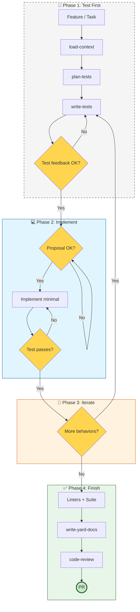
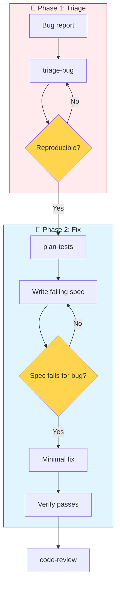
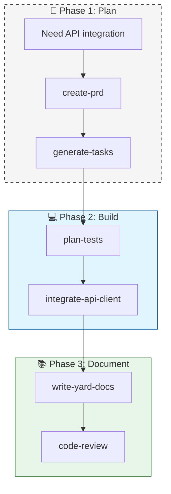

# Workflow: Development (30)

**When to use:** Write code, implement features, fix bugs, or build APIs/services.

---

## Main Flow: TDD Feature Loop



---

## Step 1: plan-tests

**Goal:** Choose the correct first failing spec.

### Decision Table: Best First Spec

| Change | Start with |
|--------|------------|
| Pure domain logic | Model or PORO service spec |
| HTTP endpoint behavior | Request spec |
| Background processing | Job spec |
| Cross-layer journey | System spec (sparingly) |
| Bug fix | triage-bug first |
| Engine feature | Engine spec with dummy app |

---

## Step 2: write-tests

**Goal:** Write the test and verify it fails.

### TDD Cycle

1. **RED:** Write failing test
2. **GREEN:** Minimal code to pass
3. **REFACTOR:** Clean up while green

### Checkpoints

- **Test Feedback Checkpoint:** Present test before implementing. Confirm: correct behavior? correct boundary? edge cases?
- **Implementation Proposal Checkpoint:** Propose approach in plain language before writing code. Confirm: which classes/methods? structure? risks?

---

## Specializations by Code Type

### Service Objects

```
plan-tests → test-service → create-service-object
```

- **Pattern:** `.call` with response contract `{ success: true/false, response: {} }`
- **Test:** `describe '.call'`, `subject(:result)`, test success and error paths

### API Integration

```
plan-tests → integrate-api-client → write-tests
```

- **Layers:** Auth → Client → Fetcher → Builder → Domain Entity
- **Testing:** Stub external with `allow(Service).to receive(:method)`

### GraphQL

```
define-domain-language → implement-graphql → plan-tests
```

- **Schema design:** Types, mutations, resolvers
- **N+1 prevention:** Dataloaders mandatory
- **Auth:** Field-level, disable introspection in prod

### Background Jobs

```
implement-background-job → plan-tests
```

- **Idempotency:** Jobs must be safe to re-run
- **Retry strategy:** Configure in job or queue adapter
- **Testing:** `have_enqueued_job`, `perform_enqueued_jobs`

### Migrations

```
review-migration → plan-tests → implement → verify up/down
```

- **Never combine:** Schema changes + data backfills
- **Always test:** `up`, `down`, data integrity
- **Large tables:** `algorithm: :concurrent` on indexes

### Authorization

```
implement-authorization → plan-tests
```

- **Patterns:** Pundit vs CanCanCan
- **Testing:** Request specs with different roles

### Performance

```
optimize-performance → write-tests → optimize
```

- **Regression spec:** Query count before optimizing
- **Tools:** Bullet, rack-mini-profiler, EXPLAIN ANALYZE

---

## Bug Fix Loop



**Key rule:** Bug triage and bug fix are distinct phases. Triage produces a failing spec; fix follows TDD loop.

---

## External API Integration



### Layered Architecture

| Layer | Responsibility | Test Strategy |
|-------|---------------|---------------|
| **Auth** | Tokens, refresh | Stub network |
| **Client** | HTTP, retries, timeout | Stub responses |
| **Fetcher** | Pagination, rate limiting | Mock client |
| **Builder** | JSON → Domain objects | Unit test |
| **Entity** | Domain model | Model spec |

---

## Skills in this Workflow

| Skill | Description | Trigger words |
|-------|-------------|---------------|
| **plan-tests** | Choose first failing spec | "where to start testing", "what test first", "TDD" |
| **write-tests** | TDD discipline, spec types | "write test", "RSpec", "test-driven" |
| **test-service** | Service object tests | "test service", "spec/services" |
| **create-service-object** | .call pattern, service design | "create service", "extract service", ".call" |
| **integrate-api-client** | External API layers | "API integration", "HTTP client", "external API" |
| **implement-background-job** | Active Job, Solid Queue, Sidekiq | "background job", "Active Job", "async" |
| **review-migration** | Safe DB migrations | "migration", "add column", "index" |
| **implement-graphql** | GraphQL schema design | "GraphQL", "resolver", "mutation" |
| **triage-bug** | Bug reproduction | "bug", "debug", "fix", "broken" |
| **implement-authorization** | Roles, permissions | "authorization", "Pundit", "CanCanCan", "roles" |
| **optimize-performance** | Query optimization | "N+1", "slow", "performance", "optimize" |
| **implement-calculator-pattern** | Variant calculators | "calculator", "strategy pattern", "dispatch" |

---

## Gates

```text
GATE 1: Test must exist and FAIL before implementation
GATE 2: Linters + Full Suite must pass before docs
GATE 3: Code review findings addressed before merge
```
