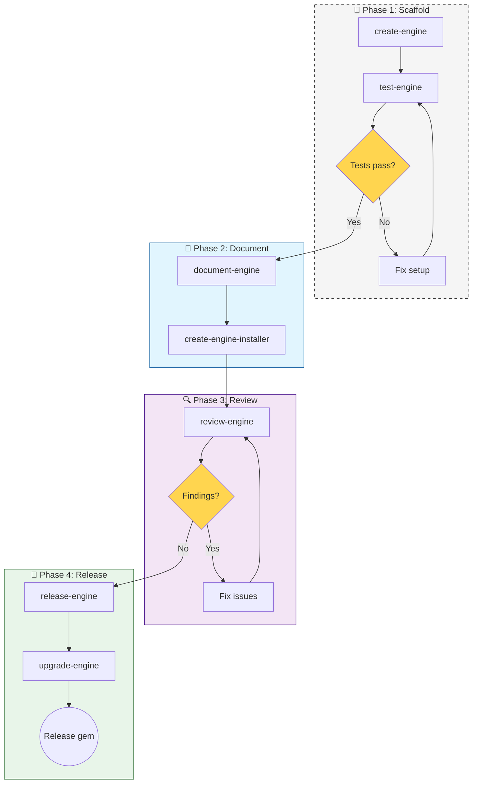
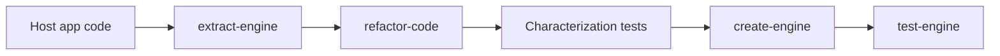

# Workflow: Engine Development (60)

**When to use:** Create, extract, or maintain Rails engines.

---

## Main Flow: New Engine



---

## Engine Skills Sequence

### 1. create-engine

**Goal:** Initial scaffolding.

- Engine type (Plain, Railtie, Engine, Mountable)
- Namespace isolation
- Host-app contract
- File structure

### 2. test-engine

**Goal:** Testing framework.

- Dummy app setup
- Request specs
- Routing specs
- Generator specs

### 3. document-engine

**Goal:** Complete documentation.

- README: installation, mounting, configuration
- Usage examples
- Extension points

### 4. create-engine-installer

**Goal:** Installation generators.

- Idempotent setup tasks
- Copy migrations
- Initializer generator
- Route mount setup

### 5. review-engine

**Goal:** Complete review.

- Namespace boundaries
- Host integration
- Safe initialization
- Test coverage

### 6. release-engine

**Goal:** Versioned release.

- Changelog
- Migration guide
- Version bump
- Gem build & publish

### 7. upgrade-engine

**Goal:** Cross-version stability.

- Zeitwerk autoloading
- CI matrix (Rails versions)
- Feature detection (no Rails.version branching)

---

## Alternative Flow: Extraction



**Key rule:** Don't extract and change behavior in the same step.

---

## API Endpoints in Engines

If the engine exposes HTTP endpoints:

```
engine skills → generate-api-collection
```

Generate or update Postman Collection for testing.

---

## Skills in this Workflow

| Skill | Description | Trigger words |
|-------|-------------|---------------|
| **create-engine** | Scaffold engine | "create engine", "new engine", "extract to engine" |
| **test-engine** | Engine test setup | "test engine", "dummy app", "engine specs" |
| **document-engine** | Engine documentation | "engine README", "install guide", "engine docs" |
| **create-engine-installer** | Install generators | "install generator", "engine setup", "copy migrations" |
| **review-engine** | Engine review | "review engine", "engine quality" |
| **release-engine** | Engine release | "release engine", "version bump", "publish gem" |
| **upgrade-engine** | Cross-version support | "Zeitwerk", "compatibility", "Rails upgrade" |
| **extract-engine** | Extract to engine | "extract feature", "move to engine", "host coupling" |
| **generate-api-collection** | API docs | "Postman", "API collection", "test endpoints" |
